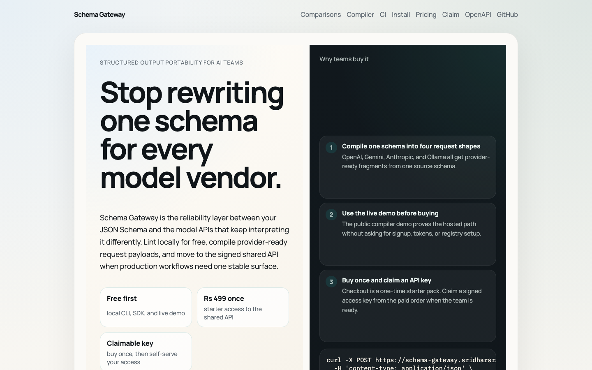

# Schema Gateway

[](https://github.com/sravan27/schema-gateway/actions/workflows/ci.yml)
[](https://github.com/sravan27/schema-gateway/releases)
[](https://schema-gateway.sridharsravan.workers.dev/diff#demo)
[](https://buy.polar.sh/polar_cl_tbNmk0GPoBOkWGf7i5PImNjhCTuDmpijaEbGy0B6ZOK)
[](https://schema-gateway.sridharsravan.workers.dev/claim)

Compile one JSON Schema into provider-ready request payloads for OpenAI, Gemini, Anthropic, and Ollama, then catch portability drift and schema regressions before they break CI or production.

[Install from GitHub release](https://schema-gateway.sridharsravan.workers.dev/install) · [Run the live regression demo](https://schema-gateway.sridharsravan.workers.dev/diff#demo) · [Run the live compiler demo](https://schema-gateway.sridharsravan.workers.dev/compiler#demo) · [Buy starter access](https://buy.polar.sh/polar_cl_tbNmk0GPoBOkWGf7i5PImNjhCTuDmpijaEbGy0B6ZOK) · [Claim a paid key](https://schema-gateway.sridharsravan.workers.dev/claim)



`Schema Gateway` is the portability layer between your JSON Schema and the model APIs that keep interpreting it differently. The codebase includes:

- a free SDK for local schema validation and tool-call normalization
- a schema portability linter that rewrites one schema into provider-safe variants
- a schema regression engine that compares a baseline and candidate schema before rollout
- a Cloudflare Worker for paid, signed normalization responses
- a Solidity paywall contract that accepts native or ERC-20 payments and emits receipts the Worker can redeem into API keys
- a Polar billing path for legal fiat checkout and API-key provisioning

## Why teams care

- one schema in, four provider-ready request shapes out
- a baseline-vs-candidate regression report for provider-specific breakage
- free-first adoption through the local CLI, SDK, GitHub Action, and hosted demo
- paid only when teams need one shared signed API surface for CI or multiple engineers
- self-serve activation through a paid order claim flow instead of manual provisioning

## Fast paths

| Goal | Path |
| --- | --- |
| Prove the value in under a minute | [Run the free regression demo](https://schema-gateway.sridharsravan.workers.dev/diff#demo) |
| Check whether a schema change is risky | [Open the diff page](https://schema-gateway.sridharsravan.workers.dev/diff) or run `schema-gateway diff --baseline ./old.json --candidate ./new.json` |
| Install without waiting on npm | [Use the release installer](https://schema-gateway.sridharsravan.workers.dev/install) |
| Add a portability check to CI | [Use the reusable GitHub Action](https://schema-gateway.sridharsravan.workers.dev/ci) |
| Buy the hosted API | [Starter access checkout](https://buy.polar.sh/polar_cl_tbNmk0GPoBOkWGf7i5PImNjhCTuDmpijaEbGy0B6ZOK) |
| Turn a paid order into a real key | [Claim API access](https://schema-gateway.sridharsravan.workers.dev/claim) |

Live surfaces:

- Site: [https://schema-gateway.sridharsravan.workers.dev](https://schema-gateway.sridharsravan.workers.dev)
- Diff: [https://schema-gateway.sridharsravan.workers.dev/diff](https://schema-gateway.sridharsravan.workers.dev/diff)
- Comparisons: [https://schema-gateway.sridharsravan.workers.dev/compare](https://schema-gateway.sridharsravan.workers.dev/compare)
- Compiler: [https://schema-gateway.sridharsravan.workers.dev/compiler](https://schema-gateway.sridharsravan.workers.dev/compiler)
- Free demo: [https://schema-gateway.sridharsravan.workers.dev/compiler#demo](https://schema-gateway.sridharsravan.workers.dev/compiler#demo)
- Regression demo: [https://schema-gateway.sridharsravan.workers.dev/diff#demo](https://schema-gateway.sridharsravan.workers.dev/diff#demo)
- Regression demo API: [https://schema-gateway.sridharsravan.workers.dev/v1/demo/diff](https://schema-gateway.sridharsravan.workers.dev/v1/demo/diff)
- GitHub CI: [https://schema-gateway.sridharsravan.workers.dev/ci](https://schema-gateway.sridharsravan.workers.dev/ci)
- Install: [https://schema-gateway.sridharsravan.workers.dev/install](https://schema-gateway.sridharsravan.workers.dev/install)
- Pricing: [https://schema-gateway.sridharsravan.workers.dev/pricing](https://schema-gateway.sridharsravan.workers.dev/pricing)
- Claim: [https://schema-gateway.sridharsravan.workers.dev/claim](https://schema-gateway.sridharsravan.workers.dev/claim)
- OpenAPI: [https://schema-gateway.sridharsravan.workers.dev/openapi.json](https://schema-gateway.sridharsravan.workers.dev/openapi.json)
- Checkout: [https://buy.polar.sh/polar_cl_tbNmk0GPoBOkWGf7i5PImNjhCTuDmpijaEbGy0B6ZOK](https://buy.polar.sh/polar_cl_tbNmk0GPoBOkWGf7i5PImNjhCTuDmpijaEbGy0B6ZOK)

Install the current SDK release without waiting for npm:

```bash
npm install \
  https://github.com/sravan27/schema-gateway/releases/download/v0.1.3/apex-value-schema-gateway-core-0.1.3.tgz \
  https://github.com/sravan27/schema-gateway/releases/download/v0.1.3/apex-value-schema-gateway-0.1.3.tgz
```

## Provider targets

Schema Gateway is built around the current structured-output surfaces that teams actually have to support:

- OpenAI Structured Outputs: [https://developers.openai.com/api/docs/guides/structured-outputs](https://developers.openai.com/api/docs/guides/structured-outputs)
- Gemini Structured Output: [https://ai.google.dev/gemini-api/docs/structured-output](https://ai.google.dev/gemini-api/docs/structured-output)
- Anthropic OpenAI SDK compatibility: [https://platform.claude.com/docs/en/api/openai-sdk](https://platform.claude.com/docs/en/api/openai-sdk)
- Ollama Structured Outputs: [https://docs.ollama.com/capabilities/structured-outputs](https://docs.ollama.com/capabilities/structured-outputs)

## Why now

The product choice is based on current merged PR and research signals from March 9, 2026 through April 8, 2026:

- OpenAI SDK release rollups repeatedly ship response type alignment and structured output fixes: [openai/openai-node#1781](https://github.com/openai/openai-node/pull/1781), [openai/openai-python#2995](https://github.com/openai/openai-python/pull/2995)
- LangChain is still landing provider-specific `response_format` compatibility fixes: [langchain-ai/langchain#34612](https://github.com/langchain-ai/langchain/pull/34612)
- Enterprise infra repos keep adding fail-fast validation, retries, and async race protection: [cloudflare/workers-sdk#13314](https://github.com/cloudflare/workers-sdk/pull/13314), [microsoft/TypeScript#63368](https://github.com/microsoft/TypeScript/pull/63368), [kubernetes/kubernetes#138059](https://github.com/kubernetes/kubernetes/pull/138059)
- Recent research points the same way: tool discovery, retry loops, routing, schema-aware outputs, and auditable agents are active areas of work: [Semantic Tool Discovery for Large Language Models](https://arxiv.org/abs/2603.20313), [Try, Check and Retry](https://arxiv.org/abs/2603.11495), [ESAinsTOD](https://arxiv.org/abs/2603.09691), [Auditable Agents](https://arxiv.org/abs/2604.05485)

## Packages

- `packages/core`: schema extraction, coercion, validation, signatures, and receipt helpers
- `packages/sdk`: the free open-source upgrade path
- `packages/worker`: the paid edge API
- `packages/contracts`: the Solidity paywall and deterministic deployment tooling

## API Surface

The Worker exposes a machine-readable spec at `/openapi.json`, and the root path `/` can serve as the public product page on a free `workers.dev` URL.

It also ships indexable comparison pages for:

- OpenAI structured outputs: `/compare/openai-structured-outputs`
- Gemini structured output: `/compare/gemini-structured-output`
- Anthropic compatibility: `/compare/anthropic-openai-compat`
- Ollama structured outputs: `/compare/ollama-structured-outputs`

And an install page for release-tarball distribution:

- GitHub release installer: `/install`
- Schema regression guardrail: `/diff`
- Schema compiler: `/compiler`
- Live compiler demo: `/compiler#demo`
- GitHub Action guide: `/ci`
- Schema regression API: `/v1/diff`

## Billing Paths

The project now supports two paid access paths:

- `Polar`: legal fiat checkout for customers, with either a stateless signed access pass claimed directly from a paid order or a webhook-backed claim flow when KV is available
- `On-chain paywall`: deterministic smart-contract purchase receipts for crypto-native access

## Local usage

```bash
npm install
npm run build
npm test
npm run bench
```

## Free SDK and paid upgrade

Use the free SDK locally first:

```ts
import { SchemaGatewayClient } from "@apex-value/schema-gateway";

const client = new SchemaGatewayClient();
const result = await client.normalizeLocal({
  schema,
  payload
});
```

Or use the CLI:

```bash
schema-gateway validate --schema ./schema.json --payload ./payload.json
schema-gateway commitment --label router-service
schema-gateway lint --schema ./schema.json --target openai,gemini
schema-gateway compile --schema ./schema.json --target openai,gemini,anthropic,ollama --name extraction_result
schema-gateway diff --baseline ./schema-old.json --candidate ./schema-new.json --target openai,gemini,anthropic,ollama
```

The compiler emits provider-ready request fragments for OpenAI Responses, OpenAI Chat Completions, Gemini, Anthropic tools, and Ollama.

To compare two schema revisions before shipping a change:

```ts
import { SchemaGatewayClient } from "@apex-value/schema-gateway";

const client = new SchemaGatewayClient();
const diff = await client.diffLocal({
  baselineSchema,
  candidateSchema,
  targets: ["openai", "gemini", "anthropic", "ollama"]
});
```

You can also try the hosted compiler without buying anything first:

```bash
curl -X POST https://schema-gateway.sridharsravan.workers.dev/v1/demo/compile \
  -H 'content-type: application/json' \
  -d '{"schema":{"type":"object","properties":{"city":{"type":"string"},"temperatureC":{"type":"number"}},"required":["city","temperatureC"],"additionalProperties":false},"targets":["openai","gemini"]}'
```

The public demo is intentionally constrained to small compile-only requests. The paid API unlocks the signed shared endpoints for `/v1/compile`, `/v1/diff`, `/v1/lint`, and `/v1/normalize`.

You can also try the public regression demo without buying anything first:

```bash
curl -X POST https://schema-gateway.sridharsravan.workers.dev/v1/demo/diff \
  -H 'content-type: application/json' \
  -d '{"baselineSchema":{"type":"object","properties":{"city":{"type":"string"}},"required":[],"additionalProperties":false},"candidateSchema":{"type":"object","properties":{"city":{"type":"string"},"temperatureC":{"type":"number"}},"required":["temperatureC"],"additionalProperties":false},"targets":["openai","gemini"]}'
```

The regression report tells you which providers got riskier, which issues were introduced or resolved, and whether the change is likely breaking.

When you want the same compiler through the hosted API with signed responses:

```bash
curl -X POST https://schema-gateway.sridharsravan.workers.dev/v1/compile \
  -H 'content-type: application/json' \
  -H 'x-api-key: sk_live...' \
  -d '{"schema":{"type":"object","properties":{"city":{"type":"string"}}},"targets":["openai","gemini"]}'
```

To request a signed regression report from the hosted API:

```bash
curl -X POST https://schema-gateway.sridharsravan.workers.dev/v1/diff \
  -H 'content-type: application/json' \
  -H 'x-api-key: sk_live...' \
  -d '{"baselineSchema":{"type":"object","properties":{"city":{"type":"string"}},"required":[],"additionalProperties":false},"candidateSchema":{"type":"object","properties":{"city":{"type":"string"},"temperatureC":{"type":"number"}},"required":["temperatureC"],"additionalProperties":false},"targets":["openai","gemini"]}'
```

Provider-specific examples live in:

- `/Users/sravansridhar/Documents/auto-money/examples/openai-responses.ts`
- `/Users/sravansridhar/Documents/auto-money/examples/langchain-ollama.ts`
- `/Users/sravansridhar/Documents/auto-money/examples/schema-portability.ts`
- `/Users/sravansridhar/Documents/auto-money/examples/schema-regression.ts`

To audit one schema across providers before you ship it:

```ts
import { SchemaGatewayClient } from "@apex-value/schema-gateway";

const client = new SchemaGatewayClient();
const report = await client.lintLocal({
  schema,
  targets: ["openai", "gemini", "anthropic", "ollama"]
});
```

To generate copy-paste request fragments from the same schema:

```ts
import { SchemaGatewayClient } from "@apex-value/schema-gateway";

const client = new SchemaGatewayClient();
const bundle = await client.compileLocal({
  schema,
  targets: ["openai", "gemini", "anthropic", "ollama"],
  name: "extraction_result"
});
```

## GitHub Action

Schema Gateway also ships a reusable GitHub Action that lints a schema in CI, can compare a baseline schema against the candidate version, and writes a job summary with top issues plus the first generated provider snippet:

```yaml
name: Schema portability

on:
  pull_request:
  push:
    branches: [main]

jobs:
  check-schema:
    runs-on: ubuntu-latest
    steps:
      - uses: actions/checkout@v5
      - uses: sravan27/schema-gateway/.github/actions/portability-check@v0.1.3
        with:
          baseline-schema: schema.prev.json
          schema: schema.json
          targets: openai,gemini,anthropic,ollama
```

When `baseline-schema` is set, the action also generates a regression section in the job summary and can fail the workflow on likely breaking schema changes.

When you need signed responses and prepaid credits, generate the same label commitment locally, buy credits on-chain with that commitment, then redeem the resulting transaction for a key:

```ts
import { buildPurchaseMetadata, SchemaGatewayClient } from "@apex-value/schema-gateway";

const { keyCommitment } = await buildPurchaseMetadata("router-service");
// Submit `keyCommitment` to the paywall contract, then:
const gateway = new SchemaGatewayClient({ baseUrl: "https://your-worker.example" });
const access = await gateway.redeemCredits({
  txHash,
  label: "router-service"
});
```

For the shortest fiat launch path, configure `POLAR_ACCESS_TOKEN` and let customers claim a signed access key directly from a paid Polar order:

```bash
curl -X POST https://your-worker.example/v1/access/polar/claim \
  -H 'content-type: application/json' \
  -d '{"orderId":"<polar-order-id>","email":"customer@example.com"}'
```

If you prefer durable prepaid credits instead, configure `POLAR_WEBHOOK_SECRET`, bind Cloudflare KV, and point Polar webhooks at `/v1/webhooks/polar`.

For the shortest launch path, see [docs/revenue-playbook.md](/Users/sravansridhar/Documents/auto-money/docs/revenue-playbook.md).

Paid users can also request a signed schema portability report:

```bash
curl -X POST https://your-worker.example/v1/lint \
  -H 'content-type: application/json' \
  -H 'x-api-key: sk_live...' \
  -d '{"schema":{"type":"object","properties":{"city":{"type":"string"}},"required":[]}}'
```

Or a signed schema regression report between a baseline and candidate schema:

```bash
curl -X POST https://your-worker.example/v1/diff \
  -H 'content-type: application/json' \
  -H 'x-api-key: sk_live...' \
  -d '{"baselineSchema":{"type":"object","properties":{"city":{"type":"string"}},"required":[],"additionalProperties":false},"candidateSchema":{"type":"object","properties":{"city":{"type":"string"},"temperatureC":{"type":"number"}},"required":["temperatureC"],"additionalProperties":false},"targets":["openai","gemini"]}'
```

Run the Worker locally:

```bash
cp .dev.vars.example .dev.vars
npm run dev
```

For local development, `.dev.vars.example` enables `ALLOW_EPHEMERAL_STORAGE=true` so you can test without Cloudflare KV. For production, you can either:

- use the stateless Polar launch path with `POLAR_ACCESS_TOKEN`, which does not require KV for the fiat path
- bind `API_KEYS`, `POLAR_CLAIMS`, and `REDEMPTIONS` KV namespaces for durable prepaid credit flows

Compile the contract:

```bash
npm run compile:contracts
```

Dry-run the deterministic deployment script:

```bash
npm run deploy:dry-run -w packages/contracts
```

## Compliance note

This repository implements a prepaid API-credit mechanism. Real deployment still requires jurisdiction-specific legal review, treasury control, and any tax or licensing work your operating entity needs.
